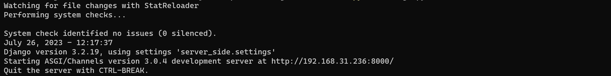
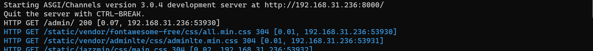
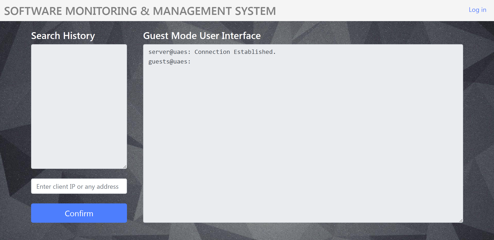
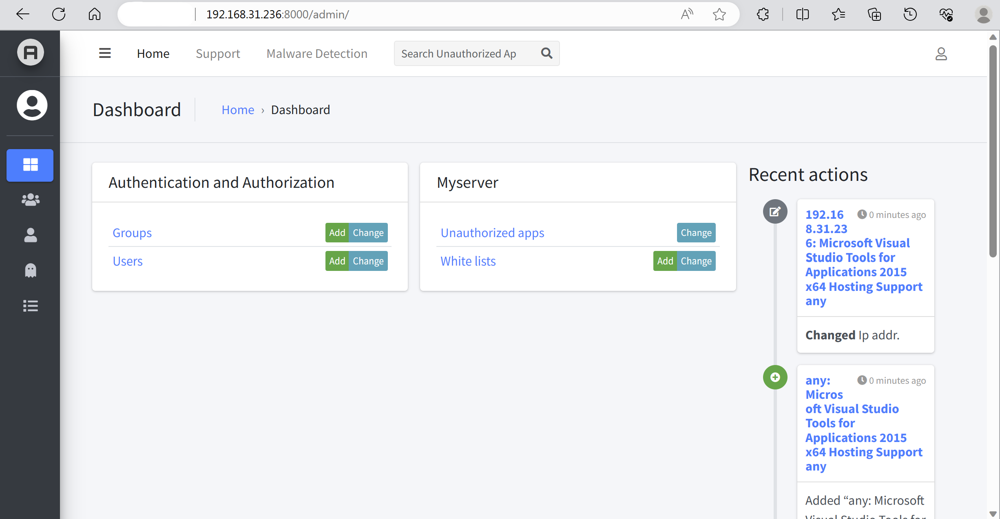

# SMMS Server

[](https://opensource.org/licenses/MIT)   

The server-side for Software Monitoring & Management System, part of the Capstone Design Project (Group05) of SJTU UMJI.

## Table of Contents

- [Overview](#overview) 
- [Features](#features) 
- [Usage](#usage) 
- [Getting Started](#getting-started) 
- [Requirements](#requirements)
- [Contributing](#contributing) 
- [License](#license) 

## Overview

In many organizations, managing software and patches installations and updates is a complex task and a critical part of business administration.

The **Software Monitoring & Management System** (SMMS) provides a comprehensive solution to **track and manage software on client devices**. It allows managers to monitor and control software authorization anywhere and ensure that all devices have the latest security patches installed.

### Objective

Out system aims at ensuring the security and authorization of all software and patches installed on terminal devices (i.e., clients) within a company. 

The primary goal is to eliminate potential risks and vulnerabilities that could compromise the company's assets.

## Features

- **Software Tracking & Management**

  The system allows administrators to track and manage software installations on client devices and provides real-time insights into the software installed on each device.

- **User-Friendly Interface**

  The admin web interface is designed with a user-friendly approach, making it intuitive and easy to navigate. Even non-technical users can quickly learn to use it effectively.

- **Authorization Control**

  The system ensures that unauthorized software and outdated security patches installed on client devices are reported to the managers, reducing potential vulnerabilities.

- **Remote Web Access**

  The server provides a secure web interface that allows users and managers to access the server from anywhere with proper authentication. (Our system is deployed on LAN by default)

## Usage

The central server will automatically collect software information from the connected clients. Here's a guide on how to use the server effectively.

#### Step 1: Edit Settings

- 


## Getting Started

To start the Software Monitoring Management System (server-side), you can  follow these steps:

1. **Clone the Repository from GitHub**

   > Open a terminal or command prompt and use the following command:

   ```bash
   git clone https://github.com/ECE4500-SU23-ProjectGroup05/server_side.git
   ```

2. **Download and Install Python**

   > Make sure you have Python installed on your computer. If you don't have it, go to the Python archives page and download Python:

   >  https://www.python.org/downloads/

3. **Install Required Python Packages**

   > Navigate to the `server_side` folder in the terminal or command prompt and install the necessary Python packages by running:

   ```bash
   pip install -r requirements.txt
   ```

4. **Check Your Router Settings (Important)**

   > Ensure that your router's settings do not have "AP isolation" enabled. This setting may prevent client devices from connecting to the server.

5. **Configure Firewall Settings (Important)**

   Before running the server, ensure that your computer's firewall allows `Python` to receive incoming connections from both Local Area Network (LAN) and Wide Area Network (WAN). 

   > Note: Firewall settings may vary based on the operating system you are using. Please refer to your OS documentation or system settings to configure the firewall properly.

6. **Find Your IPv4 Address**

   >Open the terminal or command prompt and find your computer's IPv4 address using the following command:

   ```bash
   ipconfig /all
   ```

   > Locate the `IPv4 Address` in the output.
   >
   > E.g., if your IPv4 address is `192.168.31.236`, you will use this address to run the server.

7. **Start the SMMS Server**

   > In the `server_side` folder, run the SMMS server on your server machine by executing the following command:

   ```bash
   python manage.py runserver 192.168.31.236:8000
   ```

   Replace `192.168.31.236` with your actual IPv4 address obtained from Step 5. The server will start running on port 8000.

   > Note: Make sure the port (8000 in this example) is not blocked by any firewall or network settings.

8. **Check the Running Status**

   > If you see the following message, the server is running successfully.

    

   > Once the server is running, it will be ready to accept connections from client devices.

    

9. **Access the Web UI**

   > The SMMS web interface enables convenient software management and client device monitoring from any device within the LAN using the server's IP address and port.

    

   > You can click [Log in]() to login to the admin page for details. 

    

   >The default admin user and password are `admin` and `admin@uaes`.

To set up the clients to send their software and patch information to the central server - see our [client_side](https://github.com/ECE4500-SU23-ProjectGroup05/client_side) page for details.

## Requirements

- Python >= 3.6
- Django framework
- Database (SQLite3 by default)
- Other dependencies (refer to [requirements.txt](./requirements.txt) for the complete list)

## Contributing

Contributions to the Software Management System are welcome! If you find any issues or have suggestions for improvement, feel free to open an issue or submit a pull request.

Guidelines [[How to contribute]](./guidelines/contributions.md) for pull requests and code contributions.

## License

This project is licensed under the MIT License - see the [LICENSE](./LICENSE) file for details.

## Acknowledgments

Special thanks to all contributors who have helped in the development of this system.

---

*Note: This README provides an overview of the Software Monitoring & Management System (server-side). For detailed installation and usage instructions, please refer to the [main project](https://github.com/ECE4500-SU23-ProjectGroup05/Software-Management-System) documentation.*

