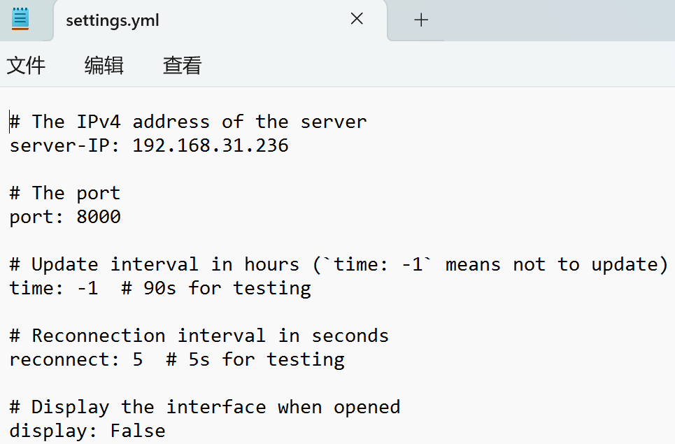
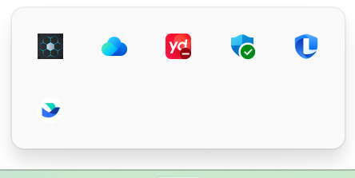
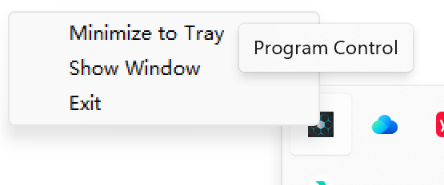
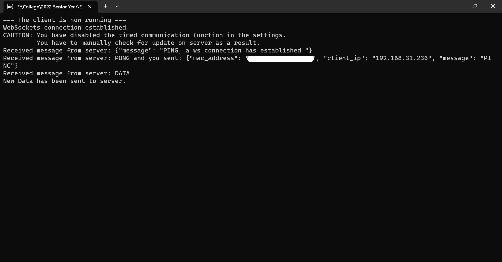

# SMMS Client

[](https://opensource.org/licenses/MIT)   

The client-side for Software Monitoring & Management System, part of the Capstone Design Project (Group05) of SJTU UMJI.

## Table of Contents

- [Overview](#overview) 
- [Features](#features) 
- [Usage](#usage) 
- [Getting Started](#getting-started) 
- [Requirements](#requirements)
- [Contributing](#contributing) 
- [License](#license) 

## Overview

In many organizations, managing software and patches installations and updates is a complex task and a critical part of business administration.

The **Software Monitoring & Management System** (SMMS) provides a comprehensive solution to **track and manage software on client devices**. It allows managers to monitor and control software authorization and ensure that all devices have the latest security patches installed.

### Objective

Out system aims at ensuring the security and authorization of all software and patches installed on terminal devices (i.e., clients) within a company. 

The primary goal is to eliminate potential risks and vulnerabilities that could compromise the company's assets.

## Features

- **Timed Client-Server Communication**

  The system operates through a client-server model, allowing clients to send software information to the central server when connected and at intervals.

- **Authorization Control**

  The system ensures that unauthorized software and outdated security patches installed on client devices are reported to the managers, preventing the use of unapproved applications and reducing potential vulnerabilities.

- **Remote Web Access**

  The server provides a secure web interface that allows users and managers to access the server from anywhere with proper authentication. (Our system is deployed on LAN by default)

## Usage

The client application will automatically send software information to the server when connected. Here's a guide on how to use the system effectively.

#### Step 1: Edit Settings

- Open the `settings.yml` as `txt` and edit the configurations as you like.

   

- `time` - the interval at which software information is automatically sent

  > disable this feature by setting `time: -1` and only allow manual updates from the server

- `display` - whether to minimize to tray automatically when opened

  > disable this feature by setting `display: True` 

- `reconnect` - the time interval for reconnecting to the server if disconnected

<div class="note">Be sure to change the `server-IP` and `port` to your actual server address!</div>

#### Step 2: Open Executable

- Open `MyClient.exe` and an icon will appear on the tray.

   

- Right click the icon to display the interface menu.

   

#### Step 3: Running the Program

- You will see the following message if data are sent to the server successfully.

   

## Getting Started

To start the Software Monitoring Management System (client-side), you can either download our latest [release](https://github.com/ECE4500-SU23-ProjectGroup05/client_side/releases) of the executable, or follow these steps:

1. Clone the repository from GitHub.

   ```bash
   git clone https://github.com/ECE4500-SU23-ProjectGroup05/client_side.git
   ```

2. Download and install Python.

   > Go to the Python archives page for Python: https://www.python.org/downloads/

3. Install the necessary packages on your client devices.

   ```bash
   pip install -r requirements.txt
   ```

4. Go to the folder `client_side` and run the SMMS client on your client machines with:

   ```bash
   python main.py
   ```
   > *Note: If your client machine is windows `x86` architecture, please branch to `win32` and run the SMMS client with:*
   >
   > ```python
   > python MyClient.py
   > ```

To set up the central server to receive software and patch information from connected clients - see our [server_side](https://github.com/ECE4500-SU23-ProjectGroup05/server_side) page for details.

## Requirements

- Python >= 3.6 or Python == 2.7
- Other dependencies (refer to [requirements.txt](./requirements.txt) for the complete list)

## Contributing

Contributions to the Software Management System are welcome! If you find any issues or have suggestions for improvement, feel free to open an issue or submit a pull request.

Guidelines [[How to contribute]](./guidelines/contributions.md) for pull requests and code contributions.

## License

This project is licensed under the MIT License - see the [LICENSE](./LICENSE) file for details.

## Acknowledgments

Special thanks to all contributors who have helped in the development of this system.

---

*Note: This README provides an overview of the Software Monitoring & Management System (client-side). For detailed installation and usage instructions, please refer to the [main project](https://github.com/ECE4500-SU23-ProjectGroup05/Software-Management-System) documentation.*

